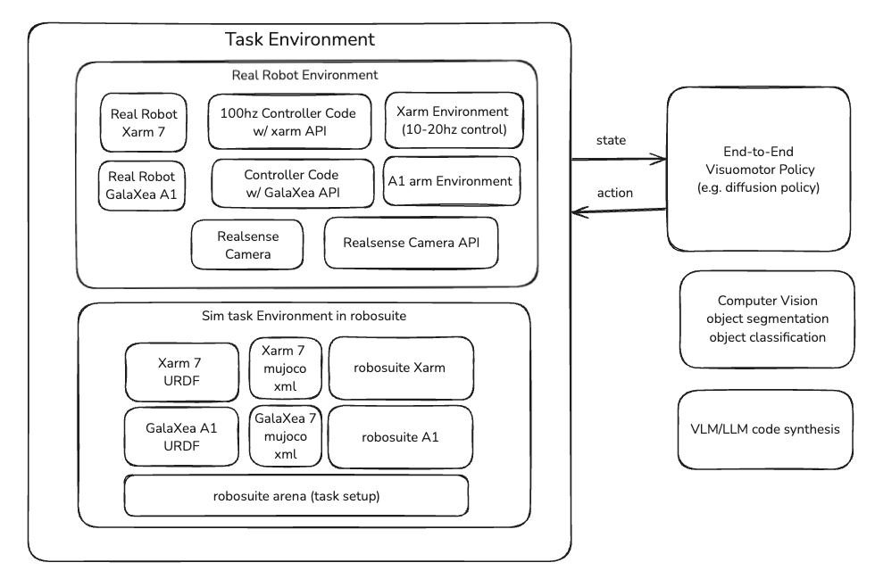

# ril-env
**ril-env** is an environment management package designed for robotic control, perception and simulation. It provides an API and programmatic interface to manage state-action flow for both real hardware robots and sensors and their simulation counterparts.

Currently, **ril-env** supports record-replay of the xArm 7 robotic arm on a single machine, with the option of camera perception running in a seperate thread.

More features will be added soon; see the issues tab under the repository.



## Having trouble connecting?
Run the following
```
sudo ip addr add 192.168.1.100/24 dev enp2s0
sudo ip link set enp2s0 up
sudo ip route add 192.168.1.223 dev enp2s0
```

## Installation
**ril-env** is tested on Ubuntu Linux with Python 3.

To get started, first clone the repository.
```
git clone https://github.com/UCLA-Robot-Intelligence-Lab/ril-env.git
```
This repository uses the `xarm` folder from the [xArm-Python-Sdk](https://github.com/xArm-Developer/xArm-Python-SDK)
package. If there are any issues, it is recommended that you do the
following:

First remove the `xarm` folder. Using the
[xArm-Python-Sdk](https://github.com/xArm-Developer/xArm-Python-SDK)
package, follow the instructions on that repo and install the package
at the root of this repository. Then after installing, move the `xarm` folder into the
root repository and remove `xArm-Python-Sdk`.

Create the conda (recommended) environment. Replace `rilenv` your preferred name for the environment. Run this at the root of your repository:
```
conda env create -n rilenv -f environment.yml
```
Finally, set up the package:
```
pip install -e .
```
## Basic Usage

Ensure that the arm is enabled on the machine you will run the relevant script on.

To run both the perception and xArm 7 robotic arm, you can use the `joint_script.py` script. 
To run perception and the robotic arm seperately, you can either run `xarm_script.py` and `camera_script.py` seperately.

You can access nearly all of the parameters for the APIs through their respective config dataclasses. Then, when writing or using a script, you simply need to specify what parameters to change and what to change them to when the `config()` object is being created.

## API Usage

There are two control stacks for the xArm 7. Pick one for the whole script — don't mix them.

- `XArm` (in `ril_env.xarm_controller`) — synchronous, single-process, takes **delta** poses. Good for quick teleop / scripts where you don't need recording.
- `XArmController` (in `ril_env.xarm_controller`) — runs the arm in a child process with shared-memory IPC, takes **absolute** poses. This is what `RealEnv` uses internally and what you want for data collection or anything that needs to read state at a fixed rate.

Both classes are context managers; always use them inside a `with` block so the process / connection is cleaned up on exit. All poses are 6-DoF `[x, y, z, rx, ry, rz]` with positions in **mm** and rotations as XYZ-Euler in **degrees**. Joint angles are 7-DoF in degrees. Grasp is `0.0` (open) or `1.0` (closed).

### Configuring the arm

```python
from ril_env.xarm_controller import XArmConfig

cfg = XArmConfig(
    robot_ip="192.168.1.223",
    frequency=30,            # control loop Hz (XArmController only)
    position_gain=2.0,       # scales dpos in XArm.step()
    orientation_gain=2.0,    # scales drot in XArm.step()
    home_pos=[0, 0, 0, 70, 0, 70, 0],  # 7 joint angles, degrees
    home_speed=50.0,
    tcp_maxacc=5000,
    verbose=False,
)
```

#### Resting (home) pose

`home_pos = [0, 0, 0, 70, 0, 70, 0]` (joint angles in degrees) corresponds to the following TCP pose on this xArm 7:

| field      | x (mm) | y (mm) | z (mm) | rx (deg) | ry (deg) | rz (deg) |
|------------|-------:|-------:|-------:|---------:|---------:|---------:|
| **TCPPose** at home | 475.79 | -1.14 | 244.72 | 179.13 | -0.01 | 0.78 |

Measured directly via `arm.get_state()["ActualTCPPose"]` after `XArm.__enter__()` ran homing. Useful as a known-safe starting pose when you want to issue absolute targets without first reading state.

### Option A: `XArm` (simple, blocking, delta control)

Entering the `with` block connects, enables motion, sets servo mode, opens the gripper, and homes the arm. Each `step()` integrates a delta into the arm's tracked pose and pushes a `set_servo_cartesian` command.

```python
import numpy as np
from ril_env.xarm_controller import XArm, XArmConfig

with XArm(XArmConfig()) as arm:
    # Move 10mm in +x, no rotation, gripper open
    arm.step(dpos=np.array([10.0, 0.0, 0.0]),
             drot=np.array([0.0, 0.0, 0.0]),
             grasp=0.0)

    # Read current state (synchronous, blocks on the API)
    state = arm.get_state()
    print(state["ActualTCPPose"])    # [x, y, z, rx, ry, rz]
    print(state["ActualTCPSpeed"])   # 6-vector
    print(state["ActualQ"])          # 7 joint angles, degrees
    print(state["ActualQd"])         # 7 joint velocities

    # Re-home at any time
    arm.home()
```

To go to a specific absolute TCP pose with this API, compute the delta against the current position yourself:

```python
target = np.array([300.0, 0.0, 250.0, 180.0, 0.0, 0.0])  # x,y,z,rx,ry,rz
with XArm(XArmConfig(position_gain=1.0, orientation_gain=1.0)) as arm:
    state = arm.get_state()
    curr = np.array(state["ActualTCPPose"])
    arm.step(dpos=target[:3] - curr[:3],
             drot=target[3:] - curr[3:],
             grasp=0.0)
```

### Option B: `XArmController` (multiprocess, absolute pose, ring-buffered state)

The controller spawns a child process that runs the servo loop at `cfg.frequency`. The parent process pushes commands onto a `SharedMemoryQueue` and reads the latest state out of a `SharedMemoryRingBuffer`. You **must** create a `SharedMemoryManager` and pass it in; the controller will not work otherwise.

```python
import time
import numpy as np
from multiprocessing.managers import SharedMemoryManager
from ril_env.xarm_controller import XArmController, XArmConfig

with SharedMemoryManager() as shm_manager:
    with XArmController(shm_manager=shm_manager,
                        xarm_config=XArmConfig()) as robot:
        # Send the arm to an absolute target pose at ~30 Hz
        target = np.array([300.0, 0.0, 250.0, 180.0, 0.0, 0.0])
        for _ in range(60):  # ~2 seconds at 30 Hz
            robot.step(pose=target, grasp=0.0)
            time.sleep(1.0 / 30.0)

        # Close the gripper
        robot.step(pose=target, grasp=1.0)
```

Notes on `XArmController.step(pose, grasp)`:
- `pose` is the **absolute** 6-DoF target, not a delta. The controller will servo toward it on its next tick.
- The controller does not interpolate to faraway poses for you — calling `step()` with a pose far from the current position will issue a `set_servo_cartesian` to that exact pose, which is unsafe at servo speeds. For large motions either step in small increments or use `XArm` with a slower-mode initialization. (Joint-space `home()` is safe to call via `arm.home()` on the legacy `XArm`; `XArmController`'s built-in HOME command is not yet reliable — see the comment in `xarm_controller.py`.)

#### Reading state from `XArmController`

The controller publishes state every tick. Two read methods:

```python
# Latest snapshot (one value per key)
state = robot.get_state()
state["TCPPose"]                  # np.ndarray shape (6,) — [x,y,z,rx,ry,rz] mm/deg
state["TCPSpeed"]                 # np.ndarray shape (6,)
state["JointAngles"]              # np.ndarray shape (7,) — degrees
state["JointSpeeds"]              # np.ndarray shape (7,)
state["Grasp"]                    # float in {0.0, 1.0}
state["robot_receive_timestamp"]  # seconds since controller start

# Last K snapshots (e.g. last 10 ticks)
hist = robot.get_state(k=10)
hist["TCPPose"].shape              # (10, 6)

# Everything currently in the ring buffer
all_state = robot.get_all_state()
```

The keys above are the raw controller keys. When you read state through `RealEnv.get_obs()` instead, they are renamed via `DEFAULT_OBS_KEY_MAP` in `ril_env/real_env.py` (e.g. `TCPPose` → `robot_eef_pose`, `JointAngles` → `robot_joint`).

### `RealEnv`: arm + cameras + replay buffer

For data collection, `RealEnv` wires `XArmController` to `MultiRealsense` and a zarr `ReplayBuffer`. See `demo_real_robot.py` for a full SpaceMouse-driven loop. The minimal shape is:

```python
import time, pathlib, numpy as np
from multiprocessing.managers import SharedMemoryManager
from ril_env.real_env import RealEnv
from ril_env.xarm_controller import XArmConfig

with SharedMemoryManager() as shm_manager:
    with RealEnv(output_dir=pathlib.Path("./recordings/"),
                 xarm_config=XArmConfig(),
                 frequency=30,
                 shm_manager=shm_manager) as env:
        env.realsense.set_exposure(exposure=120, gain=0)
        env.realsense.set_white_balance(white_balance=5900)

        state = env.get_robot_state()                 # same dict as robot.get_state()
        target_pose = np.array(state["TCPPose"], dtype=np.float32)

        env.start_episode()                            # begin recording into zarr + mp4
        for _ in range(150):                           # ~5s at 30Hz
            obs = env.get_obs()                        # dict with camera_0, robot_eef_pose, ...
            action = np.concatenate([target_pose, [0.0]])  # 6-DoF pose + grasp
            env.exec_actions(actions=[action],
                             timestamps=[time.time() + 0.1],
                             stages=[0])
            time.sleep(1.0 / 30.0)
        env.end_episode()                              # flush episode to replay_buffer.zarr
```

`exec_actions` takes arrays of `[pose(6), grasp(1)]` rows along with absolute `time.time()` timestamps; commands whose timestamps are already in the past are dropped. Episodes are written to `recordings/replay_buffer.zarr` and per-camera videos to `recordings/videos/<episode_id>/<camera_idx>.mp4`. Use `env.drop_episode()` to discard the most recent episode (e.g. on a bad demo).

### SpaceMouse input

```python
from multiprocessing.managers import SharedMemoryManager
from ril_env.spacemouse import Spacemouse

with SharedMemoryManager() as shm, Spacemouse(deadzone=0.05, shm_manager=shm) as sm:
    state = sm.get_motion_state_transformed()  # length-6: [dpos(3), drot(3)] in robot frame
    dpos, drot = state[:3], state[3:]
    grasp = sm.grasp                            # 0.0 / 1.0, toggled by buttons
    pressed = sm.is_button_pressed(1)           # True/False per button id
```

The translation/rotation transforms in `ril_env/spacemouse.py` are configured to map the device frame onto the xArm's base frame; if your mounting differs, edit `tx_translation` / `tx_rotation` there.
